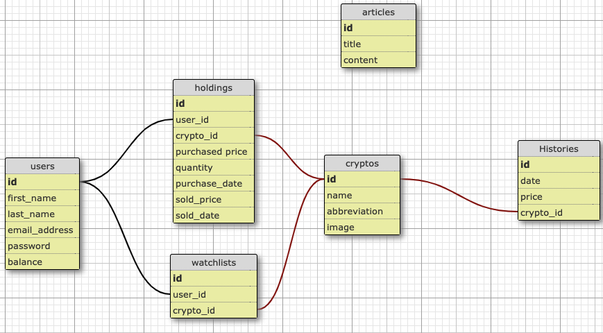
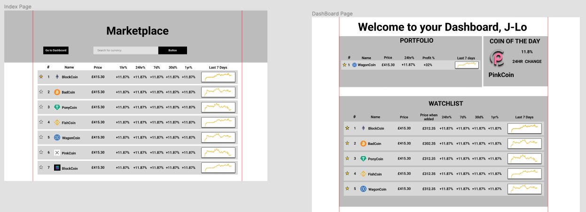

<h1 align="center">
    Cryptaul
</h1>
 

    A one-stop-shop for crypto newbies. Learn to buy and sell cryptocurrencies in a 365-day simulation

 

 

     
    <a href="https://www.cryptaul.xyz/" target='_blank'>View Demo</a>
    |
    <a href="https://github.com/awar7118/rails-cryptaul/issues">Report Bug</a>
    |
    <a href="https://github.com/awar7118/rails-cryptaul/issues">Request Feature</a>
  

  
## Table of Contents

1. [About the Project](#about-the-project)
2. [Built With](#built-with)
3. [Features](#features)
4. [Schema](#schema)
5. [Database](#database)
6. [Future Work](#future-work)
7. [Contributors](#Contributors)
8. [Acknowledgements](#acknowledgements)

## About The Project

Cryptocurrencies and decentralised finance (Defi) are taking over the world and redefining what money is. We wanted to create a platform that allows users to benefit from the features listed in the features section below, all the while eradicating financial risk and building confidence in investing in cryptocurrency.

We used the MoSCoW prioritization approach to build this project and be able to produce an MVP within the space of 2 weeks.

### Built With

- [Ruby on Rails](https://rubyonrails.org/)
- [Stimulus.js](https://stimulus.hotwired.dev/)
- [Font Awesome](https://fontawesome.com/)
- [Google Fonts](https://fonts.google.com/)
- [Sweet Alert](https://sweetalert.js.org/)
- [Chartkick](https://chartkick.com/)
- [Coingecko API](https://www.coingecko.com/en/api)
- HTML/CSS/JS

## Features

- Ability to view historic cryptocurrency data(going back 365 days) including previous prices, 24hr changes and market caps.
- Ability to add cryptocurrencies to their watchlists and keep an eye on them
- A view of the top 25 cryptocurrencies listed out in order of market cap
- A dashboard that displays all the information users need at a glance
- A jargon buster to break down technical jargon
- An additional navbar that allows you to simulate the passing of time in 1 day or 1-week increments
- An articles page that allows you to learn more about cryptocurrencies
- Ability to buy and sell cryptocurrencies at different points in time

## Schema

## Database

/db/jsondata/getjsons.rb file --> Parses data from coingecko Api endpoints. (called A and B for differentiation only)

Endpoint A - gets all the coin data, such as the symbol, logo, current price and market cap and more. 

Endpoint B - gets historical data for each cryptocurrency. This is the price each day for the past 365 days.

Data from Endpoint A gets written in /db/jsondata/crypto.json file 

Data from Endpoint B gets written in /db/jsondata/#{crypto.name}.json file. A single file for each crypto containing all the histories.

seeds.rb file --> Creates an instance of each crypto from crypto.json file and in this loop, writes crypto histories in the database.

## Figma

[Figma Link](https://www.figma.com/file/xYLh2l3KfYkSFrs20UjMfb/CrypTaul?node-id=0%3A1)

## Future work

- Allow users to compare cryptocurrencies side by side at different points in time
- Create tests for the project
- Ensure responsive web application on all screen sizes
- Include the ability to go back 5 years

## Contributors

Tara Culpin - [Github](https://github.com/taramacu)

Ahmed Warsama - [Github](https://www.linkedin.com/in/awar7118/)

Solomon Karim - [Github](https://github.com/Solkarim91)

Jeremiah Harriot - [Github](https://github.com/britishninja47)

## Acknowledgements

- [coingecko.com](https://www.coingecko.com/en)
