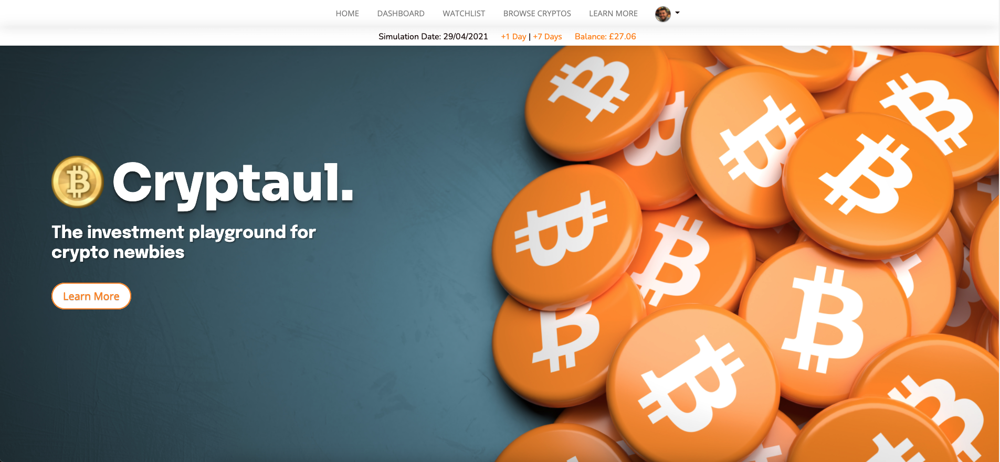
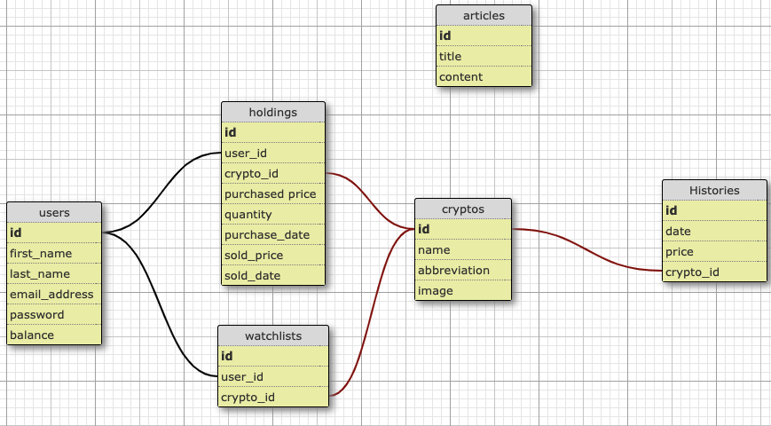
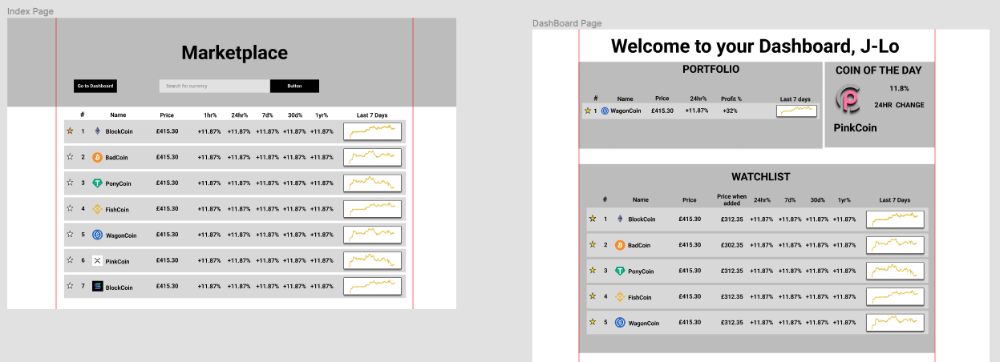

<h1 align="center">
    Cryptaul
</h1>
 

    A one-stop shop for cryptocurrency newcomers. Learn to buy and sell cryptocurrencies in a 365-day simulation.

 

 

     
    <a href="https://www.cryptaul.xyz/" target='_blank'>View Demo</a>
    |
    <a href="https://github.com/awar7118/rails-cryptaul/issues">Report Bug</a>
    |
    <a href="https://github.com/awar7118/rails-cryptaul/issues">Request Feature</a>
  

  
## Table of Contents

1. [About the Project](#about-the-project)
2. [Built With](#built-with)
3. [Features](#features)
4. [Schema](#schema)
5. [Database](#database)
6. [Future Work](#future-work)
7. [Contributors](#Contributors)
8. [Acknowledgements](#acknowledgements)

## About The Project

Cryptocurrencies and decentralised finance (DeFi) are redefining how people think about money. We created a risk-free simulation that helps newcomers build confidence while learning how cryptocurrency markets behave.

We used the MoSCoW prioritisation method to scope and deliver an MVP in two weeks.

### Built With

- [Ruby on Rails](https://rubyonrails.org/)
- [Stimulus.js](https://stimulus.hotwired.dev/)
- [Font Awesome](https://fontawesome.com/)
- [Google Fonts](https://fonts.google.com/)
- [Sweet Alert](https://sweetalert.js.org/)
- [Chartkick](https://chartkick.com/)
- [Coingecko API](https://www.coingecko.com/en/api)
- HTML/CSS/JS

## Features

- View 365 days of historical cryptocurrency prices, 24-hour changes and market capitalisation
- Add cryptocurrencies to a personal watchlist
- Browse the top 25 cryptocurrencies by market capitalisation
- Review key portfolio information from a single dashboard
- Learn terminology through a built-in jargon buster
- Simulate time passing in one-day or one-week increments
- Read introductory articles about cryptocurrencies
- Practise buying and selling at different points in the simulation

## Schema

## Database

`db/jsondata/getjsons.rb` parses data from two CoinGecko API endpoints.

- **Endpoint A** retrieves each cryptocurrency's symbol, logo, current price and market capitalisation.

- **Endpoint B** retrieves daily historical prices for the previous 365 days.

Endpoint A data is written to `db/jsondata/crypto.json`.

Endpoint B data is written to `db/jsondata/#{crypto.name}.json`, with one history file per cryptocurrency.

`seeds.rb` creates each cryptocurrency from `crypto.json` and writes its historical records to the database.

## Figma

[Figma Link](https://www.figma.com/file/xYLh2l3KfYkSFrs20UjMfb/CrypTaul?node-id=0%3A1)

## Future work

- Allow users to compare cryptocurrencies side by side at different points in time
- Create tests for the project
- Ensure responsive web application on all screen sizes
- Include the ability to go back 5 years

## Contributors

Tara Culpin - [Github](https://github.com/taramacu)

Ahmed Warsama - [Github](https://github.com/awar7118)

Solomon Karim - [Github](https://github.com/Solkarim91)

Jeremiah Harriot - [Github](https://github.com/britishninja47)

## Acknowledgements

- [coingecko.com](https://www.coingecko.com/en)
